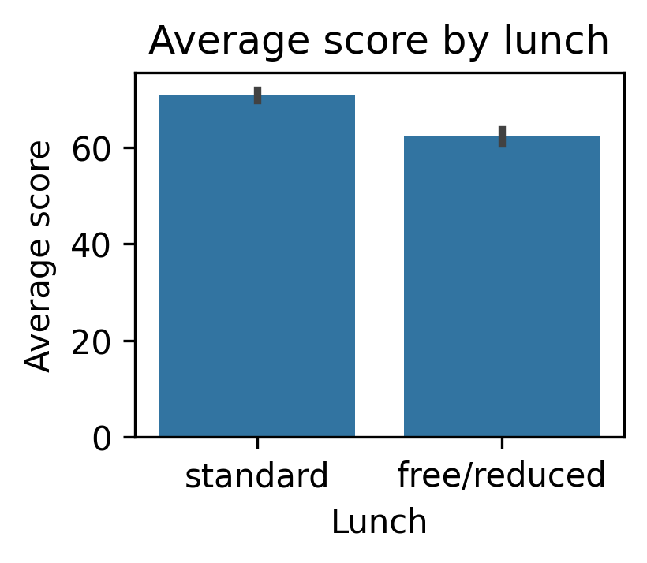
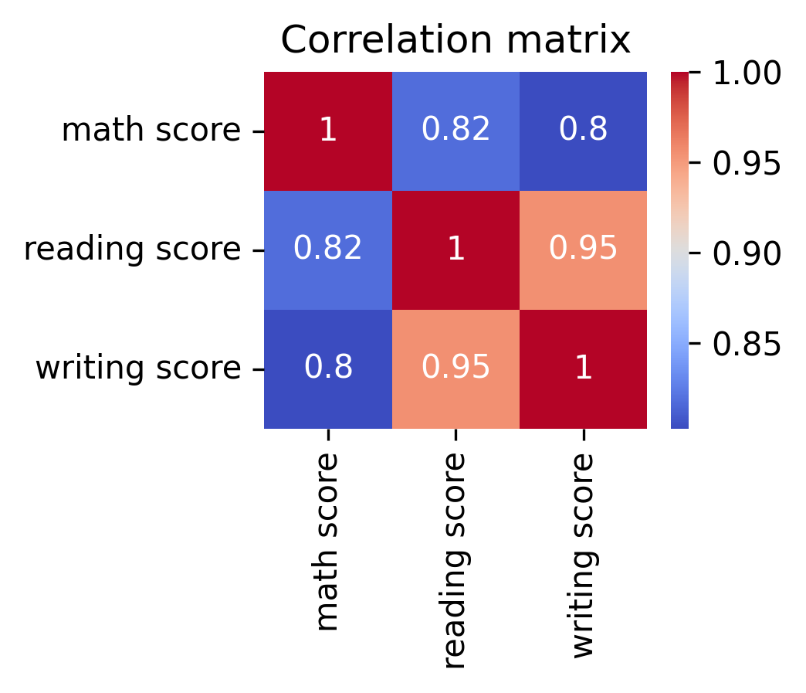
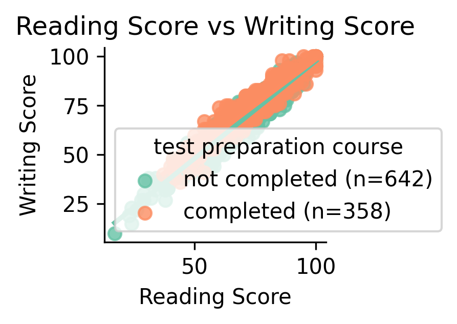

Data Visualization 1 with it's interpretation: 
--------------------------------

Interpretation: 
In Math Scores males exhibit slightly higher median math scores compared to females. The distribution also shows that males tend to achieve both higher maximum scores and higher minimum scores, indicating stronger performance across the range. Females, on the other hand, display a wider spread with more low-end outliers, suggesting greater variability in performance.

Whereas coming to Reading Scores the trend reverses in reading,i.e.females outperform males on average and females have a higher median score and a wider interquartile range (IQR) skewed towards higher values, showing that many achieve top-end performance. However, females also display some of the lowest outliers, pulling their minimum scores below those of males, While, in males reading scores are more tightly distributed, but generally lower than females at the top end.

Data Visualization 2 with it's interpretation: 
--------------------------------

Interpretation: 
By analysing this boxplot we can clearly see a substantial benefit of completing the test preparation course on math performance. i.e. Students who completed the course achieved a much higher median score compared to those who did not, making a improvement in central performance. Their scores are also more tightly clustered, indicating greater consistency at a higher level of achievement. On the other hand, non-completers displayed both a lower median and a wider score spread, with the majority falling between the lowest score than the ones completed ones. This highlights not only weaker overall performance but also less predictability in outcomes.

Data Visualization 3 with it's interpretation: 
--------------------------------

Interpretation: 
By analysing this barplot we can clearly see a performance gap in average scores between students based on lunch type. i.e.Students receiving a standard lunch consistently achieve higher mean scores across subjects compared to those on free or reduced lunch programs. This suggests that access to standard lunch may be associated with better academic outcomes

Data Visualization 4 with it's interpretation: 
--------------------------------

Interpretation: 
This correlation matrix highlights strong positive associations among math, reading, and writing scores, with coefficients ranging from 0.80 to 0.95. This indicates that students who excel in one subject are highly likely to perform well in others, reflecting a strong underlying general academic ability.

Math, while still highly correlated with reading (r = 0.82) and writing (r = 0.80), emerges as the most distinct domain. This slightly weaker relationship suggests that math incorporates additional domain-specific skills such as abstract reasoning, numerical fluency, and quantitative problem-solving.

Data Visualization 5 with it's interpretation: 
--------------------------------

Interpretation: 
The Scatter Plot shows strong positive linear relationship between reading and writing scores.So,the students who perform well in reading also perform well in writing.

When considering the effect of test preparation, the slopes of the regression lines for completers and non-completers are nearly identical, showing that the underlying relationship between reading and writing remains consistent regardless of test prep. However, the slightly higher intercept for course completers suggests a consistent advantage: at any given level of reading proficiency, students who completed the course tend to achieve marginally higher writing scores.
