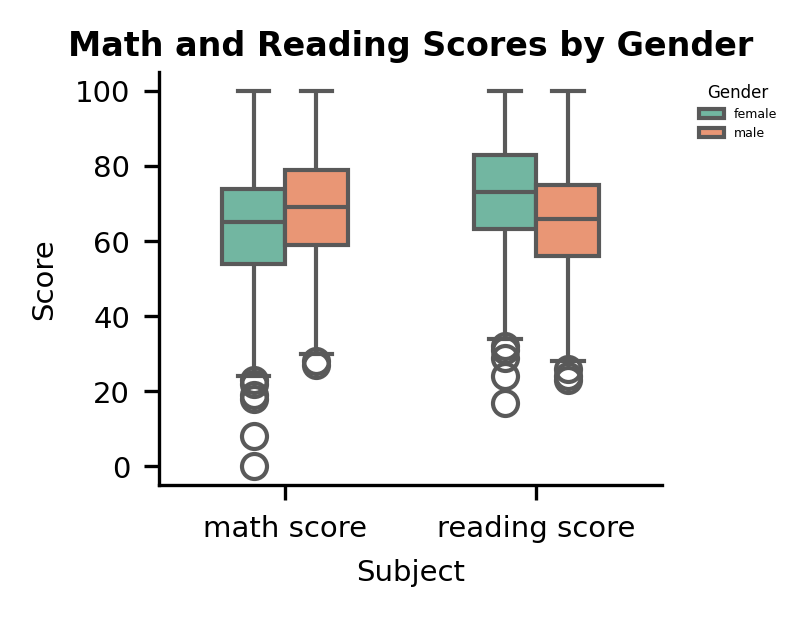
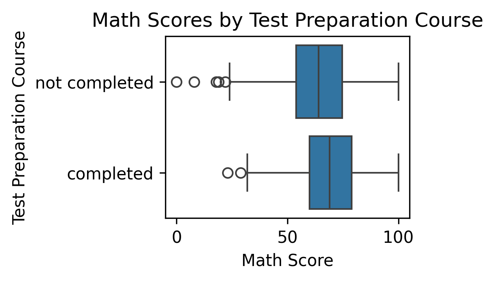

Data Visualization 1 with it's interpretation: 
--------------------------------

Interpretation: 
In Math Scores males exhibit slightly higher median math scores compared to females. The distribution also shows that males tend to achieve both higher maximum scores and higher minimum scores, indicating stronger performance across the range. Females, on the other hand, display a wider spread with more low-end outliers, suggesting greater variability in performance.

Whereas coming to Reading Scores the trend reverses in reading,i.e.females outperform males on average and females have a higher median score and a wider interquartile range (IQR) skewed towards higher values, showing that many achieve top-end performance. However, females also display some of the lowest outliers, pulling their minimum scores below those of males, While, in males reading scores are more tightly distributed, but generally lower than females at the top end.
--------------------------------
Data Visualization 2 with it's interpretation: 
--------------------------------

Interpretation: 
By analysing this boxplot we can clearly see a substantial benefit of completing the test preparation course on math performance. i.e. Students who completed the course achieved a much higher median score compared to those who did not, making a improvement in central performance. Their scores are also more tightly clustered, indicating greater consistency at a higher level of achievement. On the other hand, non-completers displayed both a lower median and a wider score spread, with the majority falling between the lowest score than the ones completed ones. This highlights not only weaker overall performance but also less predictability in outcomes.
